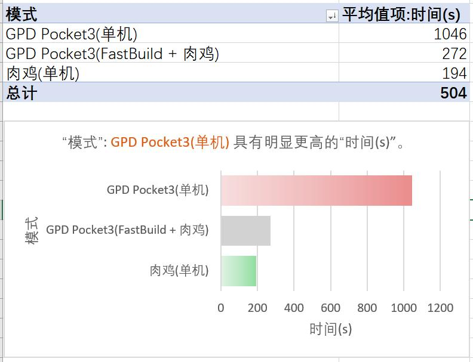
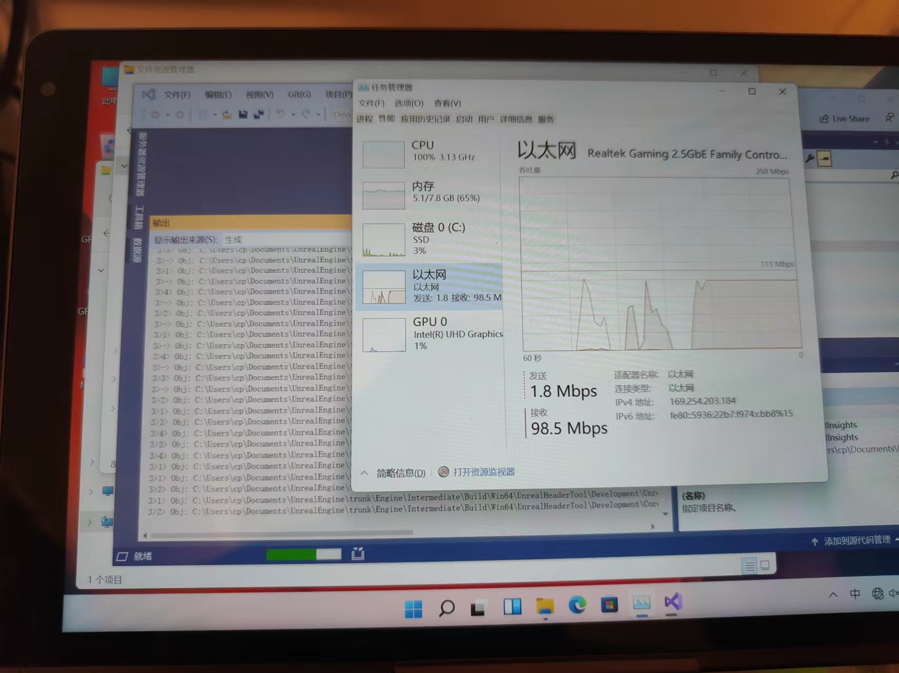
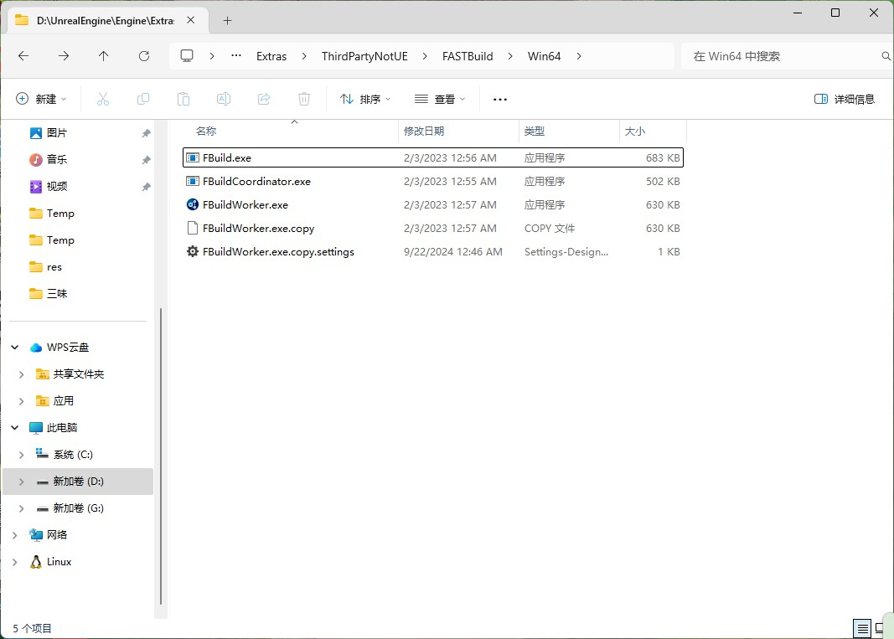
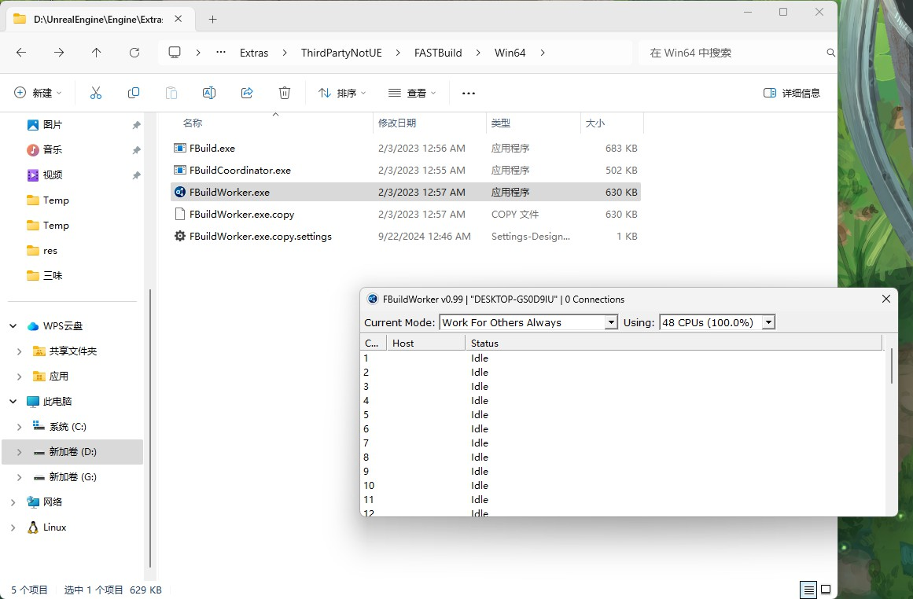
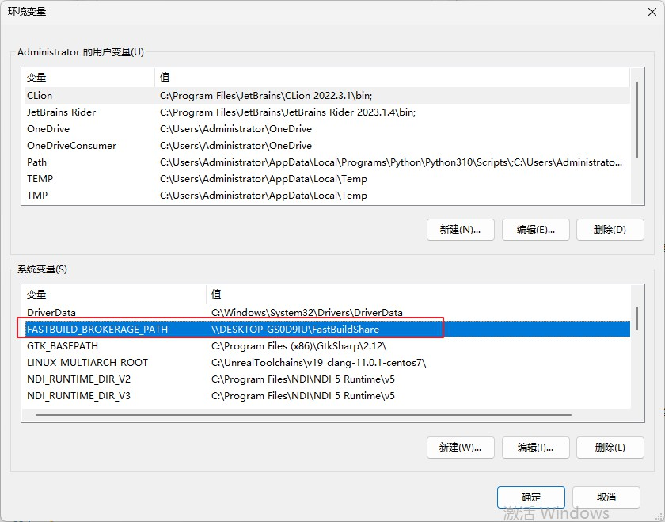
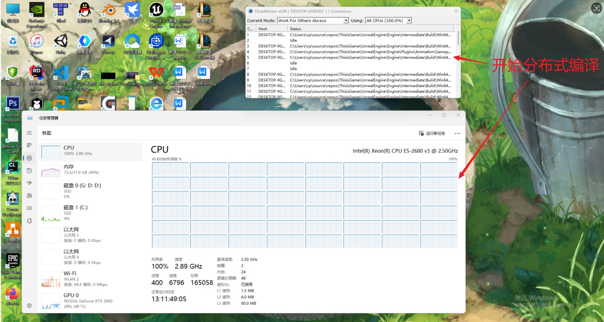

## FastBuild分布式编译

UE4.27是官方集成了FastBuild的，并且提供了FastBuild的可执行文件，在`D:\UnrealEngine\Engine\Extras\ThirdPartyNotUE\FASTBuild\Win64`目录里。

我们无需再去对FastBuild做任何修改。

本篇在Windows上来实战使用FastBuild分布式编译UE4.27中的Unreal Insights项目。

下面是机器配置：

|主机   | 肉鸡  |
|---|---|
|GPD Pocket3   | 台式机  |
|N6000@1.1GHz 4Core 4Thread |E5-2680 v3@2.5Ghz x2 24Core 48Thread|
|8GB|32GB|

编译时间对比:



可以看到，当主机很垃圾，而有其他的很强肉鸡参与分布式编译时，可以有多倍的提速。

另外它比较吃网速，这也是分布式编译的基操了，千兆是必须的，我在Wifi环境下测试的，仅供参考。

(更新:两台电脑千兆直连后降低到230s)




### 1. FastBuild介绍



FastBuild就只有这么几个文件，只需要使用`FBuildWorker.exe`和`FBuild.exe`就可以开始分布式编译。

下面介绍其作用。

#### 1.1 FBuildWorker

FBuildWorker.exe在肉鸡上执行，运行如图。



它启动后监听了31264端口，等待主机发来任务，启动后可以输入下面命令来看下监听了端口没。

```bash
C:\Users\Administrator>netstat -an |findstr 31264
  TCP    0.0.0.0:31264          0.0.0.0:0              LISTENING
```

FBuildWorker.exe在肉鸡执行后，会查找环境变量的 FASTBUILD_BROKERAGE_PATH 配置的共享文件夹，往里面写入当前的电脑名字，表示我是肉鸡，可以被其他主机使用。


#### 1.2 FBuild

FBuild.exe是主机编辑任务使用的任务分发工具.

比如我在一台垃圾电脑上，配置了UnrealBuildTools使用FastBuild，那么在垃圾电脑上编译时，就会执行FBuild.exe。

主机开始编译后，就会去环境变量的 FASTBUILD_BROKERAGE_PATH 配置的共享文件夹，查找有哪些文件，就知道了有哪些肉鸡，就会去连接，发送源码到肉鸡去编译。

下面开始实战。

### 2. 创建共享文件夹

从上面的介绍知道，需要创建一个共享文件夹，让主机和肉鸡都可以访问到。

这个共享文件夹放到任意一台电脑上都可以，只要能够访问到，并不要求是主机或肉鸡。

为了方便，这里就在肉鸡上创建。


注意添加`EveryOne`，并且给`读取/写入权限`。

创建好共享文件夹后，复制网络地址。


配置共享文件夹之后，需要在高级共享设置里开启网络发现以及关闭访问密码，如下图配置。


### 3. 肉鸡配置环境变量

在肉鸡中配置系统环境变量`FASTBUILD_BROKERAGE_PATH`指向这个共享文件夹。



### 4. 肉鸡运行FBuildWorker

在肉鸡上启动FBuildWorker。


输入下面命令来看下监听端口是否成功。

```bash
C:\Users\Administrator>netstat -an |findstr 31264
  TCP    0.0.0.0:31264          0.0.0.0:0              LISTENING
```

### 5. 肉鸡关闭防火墙


至此肉鸡已经准备完毕。

### 6. 主机配置环境变量

主机需要在高级共享设置里开启网络发现以及关闭访问密码，如下图配置。


然后文件夹地址中输入共享文件夹地址，查看是否能访问成功，成功则继续。

在主机中配置系统环境变量`FASTBUILD_BROKERAGE_PATH`指向共享文件夹。


### 7. 编译

修改UE4编译配置，增加`bAllowFASTBuild`值。

```xml
<?xml version="1.0" encoding="utf-8" ?>
<Configuration xmlns="https://www.unrealengine.com/BuildConfiguration">
    <BuildConfiguration>
        <bAllowFASTBuild>true</bAllowFASTBuild>
    </BuildConfiguration>
</Configuration>
```

打开VS，编译UE4项目，过一会儿可以看到肉鸡的FBuildWorker上显示了每个核心当前正在编译的任务，肉鸡CPU也满载。



### 8. 参考

本文参考了以下教程：

```sh
https://blueroses.top/2021/11/04/shi-yong-fastbuild-jia-kuai-unrealengine-bian-yi-su-du/

https://dev.epicgames.com/documentation/zh-cn/unreal-engine/build-configuration-for-unreal-engine?application_version=5.4

https://www.cnblogs.com/sbfhy/p/13046658.html

https://blog.csdn.net/cjw_soledad/article/details/117362397
```