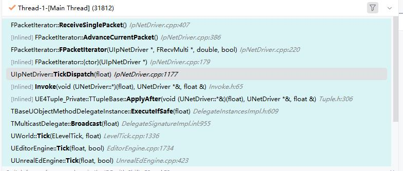
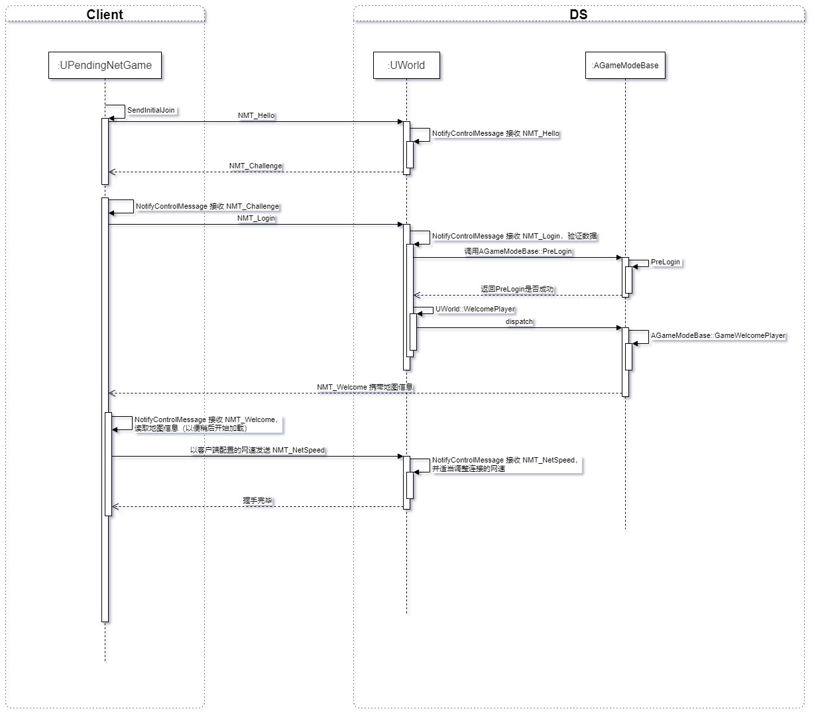

## IpNetDriver

在`UIpNetDriver::TickDispatch`中对收到的数据包进行处理。



FPacketIterator 对NetDriver收到的数据包进行遍历

FReceivedPacketView 收到的数据包

FInPacketTraits 接受的网络包的特征

bool FPacketIterator::GetCurrentPacket(FReceivedPacketView& OutPacket)//从PackageIter读取一个网络包

FPacketAudit 网络包审计，看代码是进行CRC校验，但是Shipping版本是没有的，奇怪。


UIpNetDriver::MappedClientConnections 存储远端地址与Connection指针映射关系。

DS收到一个包，但是这个包没有和一个Connection关联，那么就创建Connection
UNetConnection* UIpNetDriver::ProcessConnectionlessPacket(FReceivedPacketView& PacketRef, const FPacketBufferView& WorkingBuffer);

```c++
/**
	 * Histogram of the received packet time
	 * 接收数据包时间的直方图
	 */
	FHistogram UNetConnection::NetConnectionHistogram;
```

Challenge包
客户端和DS交互也有一个握手过程。



处理一个网络包的流程是：

UIpNetDriver::TickDispatch中先通过FPacketIterator遍历获取数据包FReceivedPacketView

然后通过包中的地址，在UIpNetDriver::MappedClientConnections找到Connection。

然后将这个包的字节数据(RawPacket)丢给Connection处理 UNetConnection::ReceivedRawPacket。

```c++
Connection->ReceivedRawPacket((uint8*)ReceivedPacket.DataView.GetData(), ReceivedPacket.DataView.NumBytes());
```

所以RawPacket就是FReceivedPacketView的字节数据。

然后在Connection中将RawPacket封装成FBitReader。

```c++
FBitReader Reader(Data, BitSize);
```

然后在`ReceivedPacket`进行处理。

```c++
void UNetConnection::ReceivedPacket( FBitReader& Reader, bool bIsReinjectedPacket)
```


