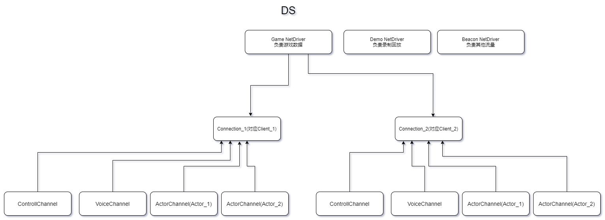
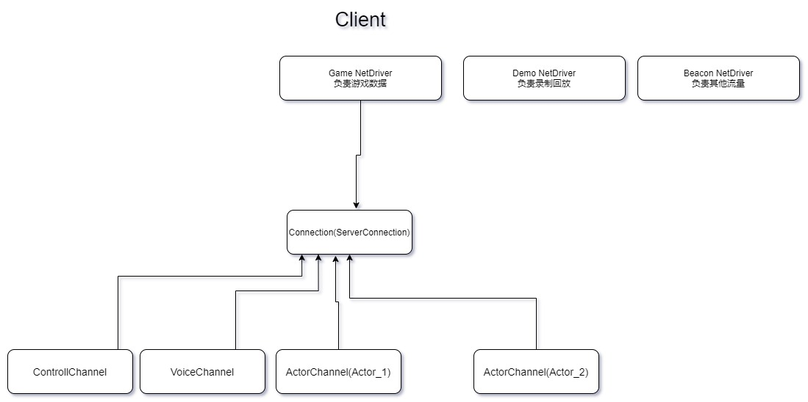

## 网络框架

参考 https://blog.csdn.net/wangchewen/article/details/120265604

### 1. Tcp和Udp的对比

TCP 和 UDP 都是具有代表性的传输层协议。

TCP 就好比打电话，通话之前先拨通电话，通了之后互相对话，信号不好的时候还是会询问“喂喂喂？“、”你那边能听到吗？“之类的确认对方能听到才继续通话，结束之后 say bye bye。

UDP 就好比寄信，提前把想说的全写信里，之后寄出去，然后就结束了。不清楚有没有到对方手里，也不清楚对方有没有回信。

UDP 想要实现可靠性传输，通常的做法是在应用层模拟 TCP 的可靠性传输。比如
 

添加发送和接收缓冲区
添加序列号和应答
添加超时重传，丢包重传
添加流量控制

### NetDrivers, NetConnections, and Channels关系

<b>UNetDrivers</b>

网络驱动，网络处理的核心，负责管理 UNetConnections，以及它们之间可以共享的数据。对于某个游戏来说，一般会有相对较少的 UNetDrivers，这些可能包括：

1、Game NetDriver：负责标准游戏网络流量

2、Demo NetDriver：负责录制或回放先前录制的游戏数据，这就是重播（观战）的工作原理。

3、Beacon NetDriver：负责不属于“正常”游戏流量的网络流量。

当然，也可以自定义 NetDrivers，由游戏或应用程序实现并使用。

<b>NetConnections</b>

表示连接到游戏（或更一般的说，连接到 NetDriver）的单个客户端。每个网络连接都有自己的一组通道，连接将数据路由到通道。

<b>Channel</b>

数据通道，每一个通道只负责交换某一个特定类型特定实例的数据信息。

1、Control Channel：用于发送有关连接状态的信息（连接是否应该关闭等）。

2、Voice Channel：用于在客户端和服务器之间发送语音数据。

3、Actor Channel：从服务器复制到客户端的每个 Actor 都将存在唯一的 Actor 通道。（Actor 是在世界中存在的对象，UE4 大部分的同步功能都是围绕 Actor 来实现的。）

在正常情况下，只有一个 NetDriver（在客户端和服务器上创建）用于“标准”游戏流量和连接。

服务器 NetDriver 将维护一个 NetConnections 列表，每个连接代表游戏中的一个玩家。它负责复制 Actor 数据。

客户端 NetDrivers 将具有一个代表到服务器的连接的单个 NetConnection。

在服务器和客户端上，NetDriver 负责接收来自网络的数据包并将这些数据包传递给适当的 NetConnection（必要时建立新的 NetConnections）。

