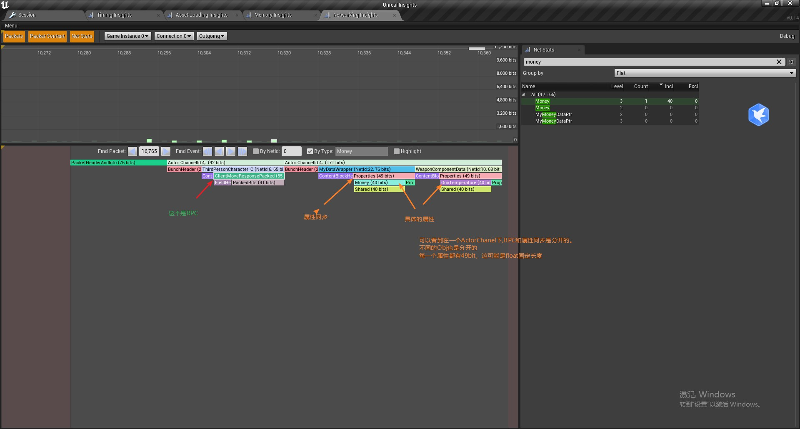
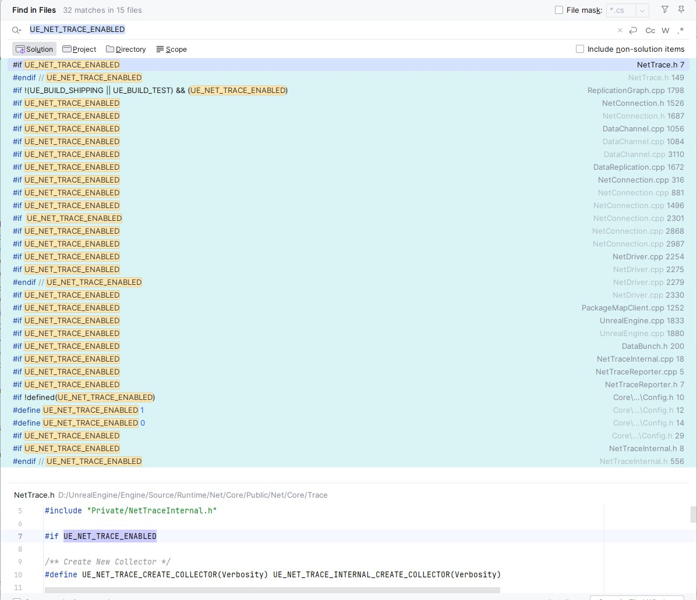

network insights效果图



在引擎启动时，读取控制台参数，来设置收集网络属性同步的数据

```cpp
//file:Engine/Source/Runtime/Engine/Private/UnrealEngine.cpp Line:1833

void UEngine::Init(IEngineLoop* InEngineLoop)
{
    ......

    #if UE_NET_TRACE_ENABLED
        uint32 NetTraceVerbosity;
        if(FParse::Value(FCommandLine::Get(), TEXT("NetTrace="), NetTraceVerbosity))
        {
            FNetTrace::SetTraceVerbosity(NetTraceVerbosity);
        }
    #endif

    ......
}
```

在UE4里，进行网络同步Trace操作的地方，都用`UE_NET_TRACE_ENABLED`包裹了，那么搜索它就能看到具体是执行了哪些Trace操作。



用到的地方其实不多。

在配置头文件中，定义这个宏开关

```cpp
//file:Engine/Source/Runtime/Net/Core/Public/Net/Core/Trace/Config.h Line:10

#if !defined(UE_NET_TRACE_ENABLED)
#	if !(UE_BUILD_SHIPPING || UE_BUILD_TEST) && UE_TRACE_ENABLED
#		define UE_NET_TRACE_ENABLED 1
#	else
#		define UE_NET_TRACE_ENABLED 0
#	endif
#endif

```

