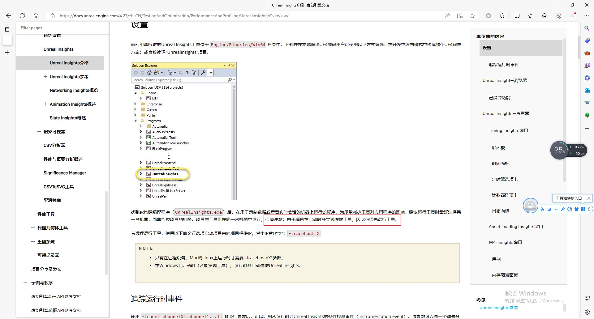
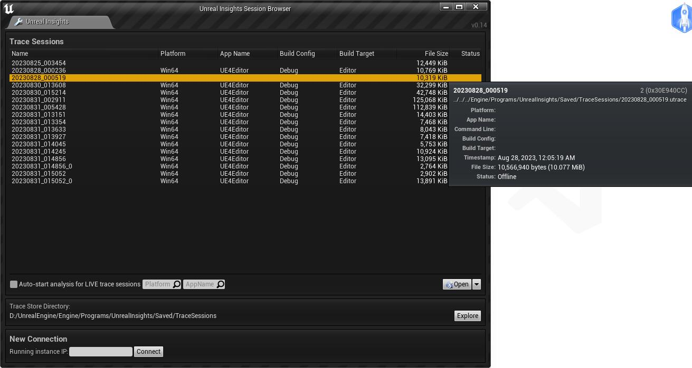

## 1.2 优化客户端重连UnrealInights

UnrealInsights必须先于游戏运行，这一点在官网中也有提到。



从上一节的时序图中也能发现，游戏运行时会连接Server，而Server是UnrealInsights运行后，才启动Server子线程。

这一点颇有不便，可以进行一些优化，改为游戏运行后，持续尝试连接Server，这样UnrealInsights运行后，可以自动连接成功。

另外发现，游戏运行时会连接Server，用的是同步连接，所以必须改为异步或者在线程中执行。

### 1. Trace初始化

Trace是UnrealInsights收集事件的框架，在游戏启动时就会初始化Trace。

```c++
///file:Engine\Source\Runtime\Core\Private\ProfilingDebugging\TraceAuxiliary.cpp

/**
 * @brief 初始化Trace辅助系统
 * @param CommandLine 命令行参数
 */
void FTraceAuxiliary::Initialize(const TCHAR* CommandLine)
{
#if UE_TRACE_ENABLED
    // 在初始化之前，先Trace出这个会话的信息，这样可以确保它总是被发送（所有通道在初始化之前都是启用的）
	// UE_TRACE_LOG是Unreal Engine中用于记录Trace事件的宏。它用于创建一个新的Trace事件并将其发送到Trace系统。
    UE_TRACE_LOG(Diagnostics, Session2, Trace::TraceLogChannel)
        << Session2.Platform(PREPROCESSOR_TO_STRING(UBT_COMPILED_PLATFORM))
        << Session2.AppName(UE_APP_NAME)
        << Session2.CommandLine(CommandLine)
        << Session2.Branch(BuildSettings::GetBranchName())
        << Session2.BuildVersion(BuildSettings::GetBuildVersion())
        << Session2.Changelist(BuildSettings::GetCurrentChangelist())
        << Session2.ConfigurationType(uint8(FApp::GetBuildConfiguration()))
        << Session2.TargetType(uint8(FApp::GetBuildTargetType()));

    // 初始化Trace
    Trace::FInitializeDesc Desc;
    Desc.bUseWorkerThread = FPlatformProcess::SupportsMultithreading();
    Trace::Initialize(Desc);

    // 添加Trace更新到帧结束的委托
    FCoreDelegates::OnEndFrame.AddStatic(Trace::Update);

    // 当模块改变时，启用通道
    FModuleManager::Get().OnModulesChanged().AddLambda([](FName Name, EModuleChangeReason Reason){
        if (Reason == EModuleChangeReason::ModuleLoaded)
        {
            EnableChannels();
        }
    });

    // 从命令行中提取一个显式的通道集
    FString Parameter;
    if (FParse::Value(CommandLine, TEXT("-trace="), Parameter, false))
    {
        GTraceAuxiliary.AddChannels(*Parameter);
        GTraceAuxiliary.EnableChannels();
    }

	AppCommandLine = CommandLine;

    // 从命令行解析出Server地址或者Trace文件保存地址
    if (FParse::Value(CommandLine, TEXT("-tracehost="), TraceHost))
    {
        bConnectedTraceHost=GTraceAuxiliary.Connect(ETraceConnectType::Network, *TraceHost);
    }
    else if (FParse::Value(CommandLine, TEXT("-tracefile="), Parameter))
    {
        bConnectedTraceHost=GTraceAuxiliary.Connect(ETraceConnectType::File, *Parameter);
    }
    else if (FParse::Param(CommandLine, TEXT("tracefile")))
    {
        bConnectedTraceHost=GTraceAuxiliary.Connect(ETraceConnectType::File, nullptr);
    }

    // 注册线程
    Trace::ThreadRegister(TEXT("GameThread"), FPlatformTLS::GetCurrentThreadId(), -1);

#endif
}
```

从代码中看出，是先通过 `UE_TRACE_LOG` 记录了一些当次会话的信息数据，然后才调用`Trace::Initialize(Desc);`初始化，最后才通过`GTraceAuxiliary.Connect`连接到Server。

理论上只要将`GTraceAuxiliary.Connect`放到线程中执行并持续重试，就可以达到我们的目的。

但实际情况要复杂一些，通过 `UE_TRACE_LOG` 记录的当次会话的信息数据，在第一次`GTraceAuxiliary.Connect`失败后会被清除掉！

数据清除后，即使后续`GTraceAuxiliary.Connect`成功，在UnrealInsights SessionBrowser里就解析不到这次会话的信息了。



那数据是在哪里被清除的，继续往下看。

### 2. Trace数据的上传

按照经验，客户端记录的数据一般是在主线程写入到一个Buffer中，然后在一个线程中从Buffer里取出一部分，并发送到Server。

Trace框架中也不例外。

在Trace初始化时，就会创建Writer线程。

```c++
///file:Engine\Source\Runtime\TraceLog\Private\Trace\Writer.cpp

static void Writer_WorkerCreate()
{
	if (GWorkerThread)
	{
		return;
	}

	GWorkerThread = ThreadCreate("TraceWorker", Writer_WorkerThread);
}
```

`Writer_WorkerThread()`就是用来上传数据的线程执行函数。

```c++
///file:Engine\Source\Runtime\TraceLog\Private\Trace\Writer.cpp

/*
定义工作线程函数。
定义了一个工作线程，该线程在启动时会暂停一段时间，以便用户设置trace的发送目标。
然后，只要没有收到退出信号，就会持续更新工作线程。
*/
static void Writer_WorkerThread()
{
    // 注册名为"Trace"的线程，其系统ID为0，排序提示为INT_MAX
    Trace::ThreadRegister(TEXT("Trace"), 0, INT_MAX);

    // 在此点，我们还没有收集任何trace事件。所以我们会稍微停顿一下，
    // 给用户一个机会去设置发送trace的地方。这样他们可以获取自启动以来的所有事件，
    // 否则它们将被无情地丢弃。
    int32 PrologueMs = 2000;
    do
    {
        const uint32 SleepMs = 100;
        ThreadSleep(SleepMs);
        PrologueMs -= SleepMs;

        // 如果更新连接成功，则跳出循环
        if (Writer_UpdateConnection())
        {
            break;
        }
    }
    while (PrologueMs > 0);

    // 当没有收到工作线程退出的信号时，持续更新工作线程
    while (!GWorkerThreadQuit)
    {

        Writer_WorkerUpdate();

        // 线程休眠17毫秒
        const uint32 SleepMs = 17;
        ThreadSleep(SleepMs);
    }
}
```

在函数里，首先会等待2s，等待`GTraceAuxiliary.Connect`连接Server结果。

2s后不管是否连接，都进入到`Writer_WorkerUpdate()`去执行线程主逻辑。

```c++
///file:Engine\Source\Runtime\TraceLog\Private\Trace\Writer.cpp

// 定义工作线程更新函数
static void Writer_WorkerUpdate()
{
    // 更新控制信息
    Writer_UpdateControl();
    
    // 更新连接状态
    Writer_UpdateConnection();
    
    // 描述并公告事件和通道
    Writer_DescribeAnnounce();
    
    // 清空缓冲区
    Writer_DrainBuffers();
}
```

在线程主逻辑里，不管有没有连接Server成功，最后都会清空缓冲区。

这就是问题了！


### 3. 支持重连

那么要支持先开游戏，后打开UnrealInsights，需要解决2个问题：

1. 在子线程中进行重连
2. Trace记录在连接成功之前不能被清空。

#### 3.1 在子线程中进行重连

在`FTraceAuxiliary::Initialize`首次连接Server后，立即开启线程进行重连。

```c++
///file:Engine\Source\Runtime\Core\Private\ProfilingDebugging\TraceAuxiliary.cpp

/**
 * @brief 初始化Trace辅助系统
 * @param CommandLine 命令行参数
 */
void FTraceAuxiliary::Initialize(const TCHAR* CommandLine)
{
    ......

    // 尝试从命令行发送Trace数据到某个地方
    if (FParse::Value(CommandLine, TEXT("-tracehost="), TraceHost))
    {
        bConnectedTraceHost=GTraceAuxiliary.Connect(ETraceConnectType::Network, *TraceHost);
    }
    
    ......

#if PLATFORM_WINDOWS //只在Win Standalone模式开启线程Connection
	if (TraceHost.Len() >0 && bConnectedTraceHost==false)
	{
		if (!GFTraceAuxiliaryWorkerThreadInitialized)
		{
			//利用RAII创建线程与关闭线程。
			class FTraceAuxiliaryWorkerRunnable : public FRunnable
			{
			public:
				FTraceAuxiliaryWorkerRunnable()
				{
					GFTraceAuxiliaryWorkerThreadInitialized=true;
				}

			    virtual uint32 Run() override
			    {
			        FTraceAuxiliary_WorkerThread();
					return 0;
			    }
			};

			FRunnable* TraceAuxiliaryWorkerRunnable = new FTraceAuxiliaryWorkerRunnable();
			FRunnableThread* MyThread = FRunnableThread::Create(TraceAuxiliaryWorkerRunnable, TEXT("TraceAuxiliaryWorkerRunnableThread"));
		}
	}
	
#endif

#endif
}
```

连接成功后即退出子线程。

```c++

static void FTraceAuxiliary_WorkerThread()
{
#if PLATFORM_WINDOWS
    // 当没有收到工作线程退出的信号时，持续更新工作线程
    while (!GFTraceAuxiliaryWorkerThreadQuit)
    {
	    const bool bConnect=FTraceAuxiliary::CheckConnection();

		if(bConnect)//连接成功或取消，关闭线程。
		{
			break;
		}

        // 线程休眠1秒
		FPlatformProcess::Sleep(1.0f);
    }
#endif
}

bool FTraceAuxiliary::CheckConnection()
{
#if UE_TRACE_ENABLED

	//const bool bConnected = Trace::IsTracing();

	//if(bConnected && bConnectedTraceHost)
	if(bConnectedTraceHost) //暂时不做重连。只做第一次打开。
	{
		return true;
	}

	if (TraceHost.Len() == 0)//没有配置Host，返回true，关闭线程。
	{
		return true;
	}

	// 尝试重连
	bConnectedTraceHost = GTraceAuxiliary.Connect(ETraceConnectType::Network, *TraceHost);

	//如果是第一次重连，那么从游戏运行后开始到重连成功的Trace数据都会发出去，Head Channel Thread数据都会发送。
	//但如果是连接成功后的重连，那么相对于UnrealInsights来说，是一个新的Session，新的Session需要发送新的Head Channel Thread数据才可以，不然在Unreal Insights中识别不到。

	//方法2：需要统计在连接成功之前，缓存了哪些Trace。还有个问题是，断线重连后，之前的全局Buffer应该清掉。
	 if(bConnectedTraceHost==false)
	 {
		return false;
	 }

	UE_TRACE_LOG(Diagnostics, Session2, Trace::TraceLogChannel)
		 	<< Session2.Platform(PREPROCESSOR_TO_STRING(UBT_COMPILED_PLATFORM))
		 	<< Session2.AppName(UE_APP_NAME)
		 	<< Session2.CommandLine(*AppCommandLine)
		 	<< Session2.Branch(BuildSettings::GetBranchName())
		 	<< Session2.BuildVersion(BuildSettings::GetBuildVersion())
		 	<< Session2.Changelist(BuildSettings::GetCurrentChangelist())
		 	<< Session2.ConfigurationType(uint8(FApp::GetBuildConfiguration()))
		 	<< Session2.TargetType(uint8(FApp::GetBuildTargetType()));

		EnableChannels();
#endif

	return true;
}
```

#### 3.2 保持Trace记录

这个简单，只要在Writer线程中，一直等待连接Server成功，然后才进入线程主循环即可。

```c++
static void Writer_WorkerThread()
{
    ......

    do
    {
        ......
    }
    while (true);//一直等待连接Server成功，然后才进入线程主循环。

    ......
}
```

### 4. 测试

现在可以测试下，先开启游戏，再开启UnrealInsights。

