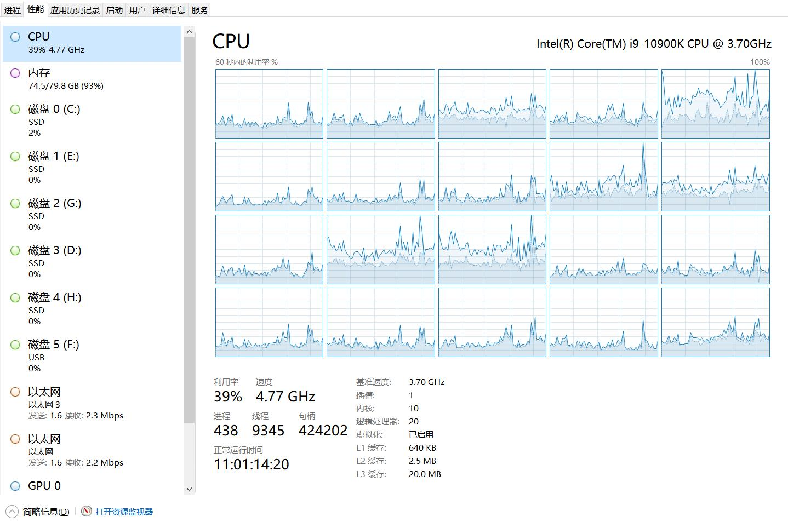
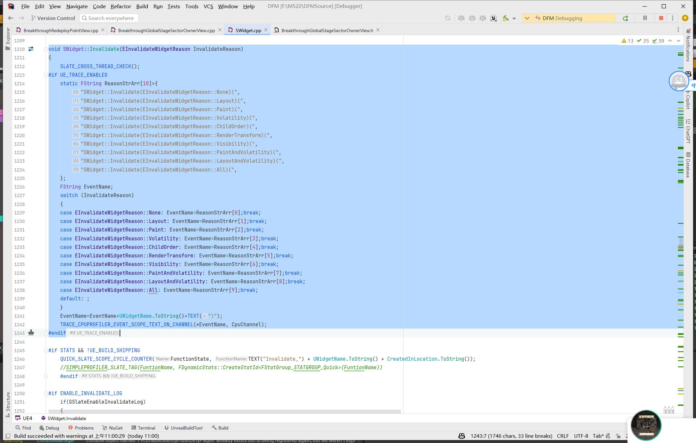
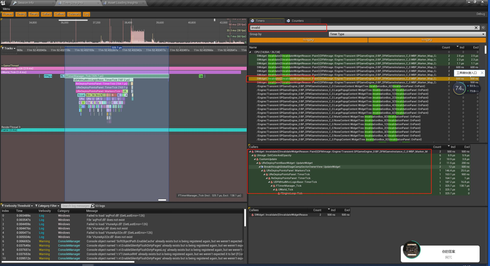
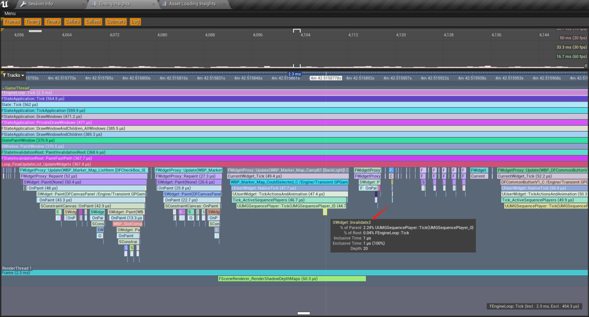
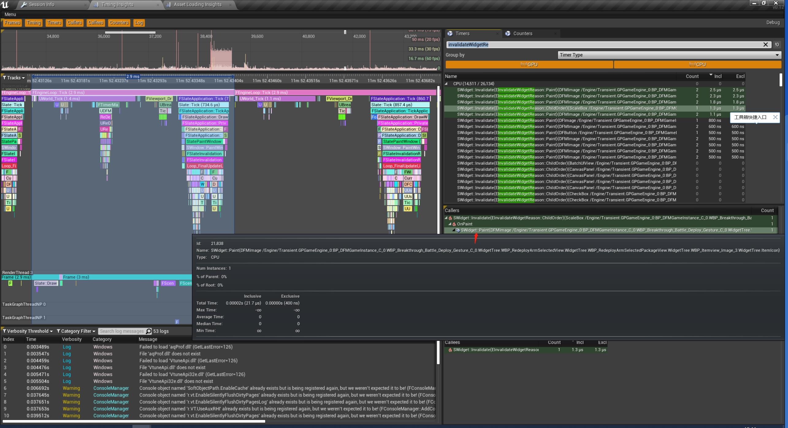
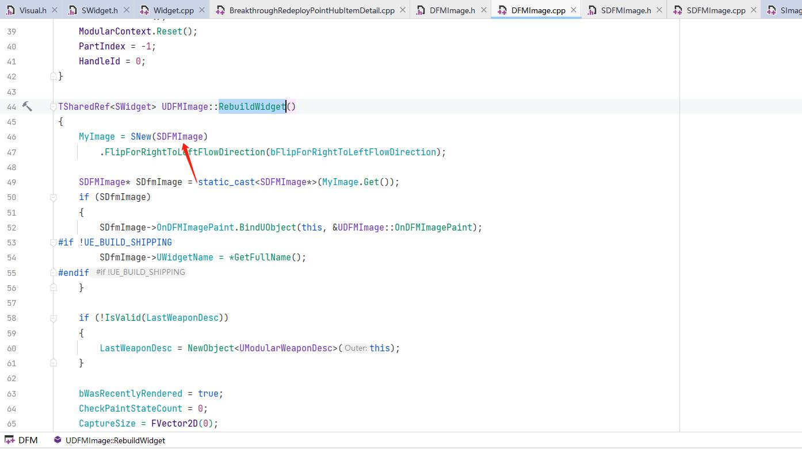
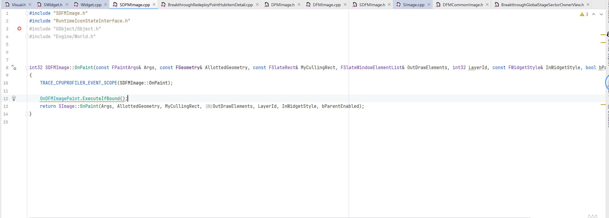

## 1.5 性能热点

机器配置



| 采样  | 耗时参考   |
|:---|:---|
|FindComponentByClass   |  6.4 us |
|FMath::VInterpTo| 700ns|
|TRACE_CPUPROFILER_EVENT_SCOPE|100ns|
|UGameplayBlueprintHelper::GetLocalGPCharacter|400ns|
|UIImage::SetColorAndOpacity|1us|
|UImage::SetBrushFromAtlasInterface|内置对比|
|LogE|100us|

### 关闭帧率限制

```
t.MaxFPS -1
```

### 优化点

1. 当每帧耗时高于Timer间隔时间，Timer会追加调用次数，会出现一帧调用多次。


### UI重绘

当绘制一个Widget后，我们最期望的是它利用显存中已经存在的数据去绘制下一帧，而不是再从CPU传送数据过去。

但是这个条件很难满足，在Slate框架中列出了导致UI重绘的一些原因。

```c++
/**
 * @brief 定义了可能的Widget无效化类型，包括布局、绘制、易变性、子项顺序、渲染变换和可见性等。每种无效化类型都对应一个位标志，可以通过位运算组合多种无效化类型。
 */
enum class EInvalidateWidgetReason : uint8
{
    None = 0, ///< 无无效化。

    /**
     * @brief 如果Widget需要改变期望大小，使用Layout无效化。这是一种昂贵的无效化，所以如果只需要重绘Widget，不要使用。
     */
    Layout = 1 << 0,

    /**
     * @brief 当Widget的绘制被改变，但没有影响大小时使用。
     * @note 当Widget的绘制被改变，但没有影响到布局时，会使用Paint无效化。例如，如果Widget的颜色或纹理被改变，但其大小和位置保持不变，那么就会触发Paint无效化。这种无效化类型只会导致Widget的重新绘制，而不会重新计算布局。
     */
    Paint = 1 << 1,

    /**
     * @brief 如果只是调整了Widget的易变性，使用此选项。
     * @note 📌  unfiled/2D8h5fpJhPUtbEMYWWVAQz.md 📝 🗑️
     */
    Volatility = 1 << 2,

    /**
     * @brief 添加或删除了子项。（这意味着布局）
     */
    ChildOrder = 1 << 3,

    /**
     * @brief Widget的渲染变换发生了改变。
     * @note 当Widget的渲染变换（如旋转、缩放、偏移等）发生改变时，会使用RenderTransform无效化。这种无效化类型会导致Widget的重新绘制，但不会重新计算布局。
     * @note 📌  unfiled/rWqe2BJyBS7zW9GNz9YAAZ.md 📝 🗑️
     * @note 📌  unfiled/Layout_vs_RenderTransform_d5ujZfww5Pkir2gpF1F7AG.md 📝 🗑️
     * @note 📌  unfiled/paint_vs_redertransform_qXBrDUBNWi9p4BhNSY7A1Q.md 📝 🗑️
     *
     */
    RenderTransform = 1 << 4,

    /**
     * @brief 改变可见性（这意味着布局）
     */
    Visibility = 1 << 5,

    /**
     * @brief 如果你改变了涉及绘制或大小的普通属性，使用Paint无效化。
     *        此外，如果改变的属性以任何方式影响了Volatility，那么重要的是要使volatility无效，以便可以重新计算和缓存。
     */
    PaintAndVolatility = Paint | Volatility,

    /**
     * @brief 如果你改变了涉及绘制或大小的普通属性，使用Layout无效化。
     *        此外，如果改变的属性以任何方式影响了Volatility，那么重要的是要使volatility无效，以便可以重新计算和缓存。
     */
    LayoutAndVolatility = Layout | Volatility,

    /**
     * @brief 除非你知道自己在做什么，否则永远不要使用这个。
     */
    All UE_DEPRECATED(4.22, "EInvalidateWidget::All has been deprecated.  You probably wanted EInvalidateWidget::Layout but if you need more than that then use bitwise or to combine them") = 0xff
};
```

那么做UI性能优化，就是去避免出现UI重绘。

我在`SWidget::Invalidate`里添加了Trace.



这样在UnrealInsight里根据Trace堆栈和Reason能迅速定位到触发Invalidate的原因，从而进行优化。



下面列出一些常用优化点

1. 简单的UI动效，例如Alpha闪烁效果，放到Shader中执行。
    

2. 检查代码是否每帧调用了`SetColorAndOpacity` `SetOpacity`等函数，这会触发`EInvalidateWidgetReason::Paint`


### UWidget如何找对应的SWidget

例如下面的SWidget::Paint调用了OnPaint触发了Invalidate，可以看到是一个DFMImage导致的。



去DFMImage里并没有看到OnPaint。

这时候可以在`RebuildWidget`函数里找到对应的S类。



这样就能定位到问题。



### Slate默认缓存优化

Slate底层做了缓存优化，像 `STextBlock::SetText` 里面会比较Text是否变化，来跳过重绘。

但是从UTextBlock到STextBlock垮了一层框架，且比较字符串也是个耗时操作，所以在逻辑层能用简单方法判断的，就直接Return掉比较好。

比如显示的数值，那么可以在逻辑层与上一次的数值比较，变化了才设置到Text。

### Insight妙用

在Slate每个阶段都打上Trace标记后，在Timeline就可以直观的，了解到整个渲染节奏，查Bug很方便。

例如在Layer变化时打上Trace标记，在Timeline就能看到Layer在哪里增加。

