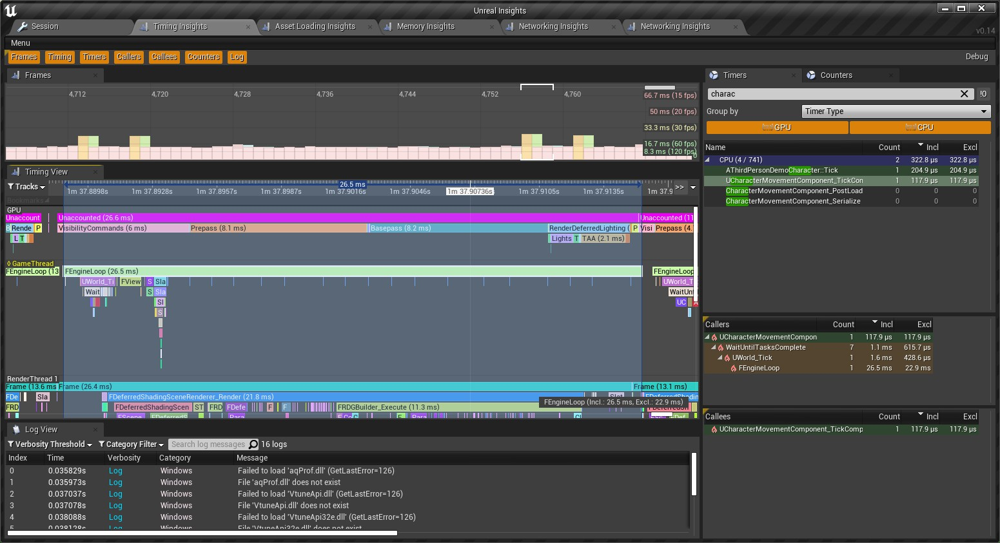

## 1. Unreal Insights

以前用Unity开发游戏，都是一直开着Profiler，而到了UE这里，一年都没用过几次。

和同事交流后，大概都是觉得很难找到UE的Profiler在哪里，在FrontEnd找到后也很难使用。

比较少人知道有Unreal Insights这么个东西。

```bash
官方文档：https://docs.unrealengine.com/4.27/zh-CN/TestingAndOptimization/PerformanceAndProfiling/UnrealInsights/Overview/
```


### 1.关于Profiler

所谓Profiler，核心就是对一个范围内的代码进行统计计数，CPU Profiler就是统计开始执行前的时间，结束的时间，然后相减就得到逻辑代码的耗时。

在项目中常使用StopWatch来实现，例如：

```c++
StopWatch stopwatch;
stopwatch.start();
......

stopwatch.stop();
```

如果再对输出的log加上层次关系，那么也可以成为不错的性能分析工具。

在[《游戏引擎 浅入浅出》](https://www.thisisgame.com.cn/tutorial?book=cpp-game-engine-book&lang=zh&md=Introduction.md)的 [[16.Profiler]](https://www.thisisgame.com.cn/tutorial?book=cpp-game-engine-book&lang=zh&md=16.%20profiler/16.%20profiler.md) 介绍了Profiler以及游戏引擎中如何集成`easy_profiler`。

`easy_profiler`将函数耗时数据以火焰图形式呈现。


### 2.关于UnrealInsights

第一次见到UnrealInsights，就觉得它很熟悉，它和`easy_profiler`几乎一模一样。



使用方式也和`easy_profiler`如出一辙，虽然相比`easy_profiler`来说没那么好用而且有些Bug，但是胜在专业。

那么后续就对Unreal Insights进行介绍以及分析，然后针对需求进行一些拓展。

