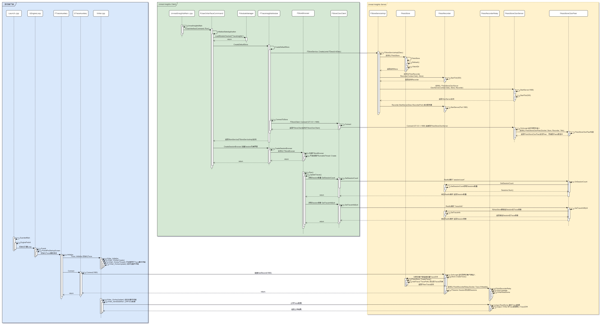
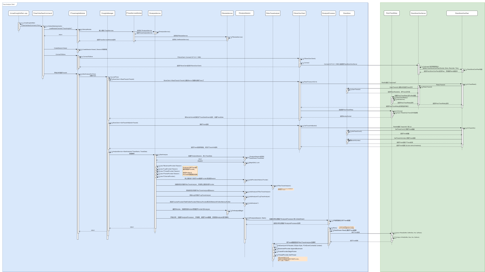

## 1.1 UnrealInights网络架构

### 1.性能数据收集流程

UnrealInsights是基于Trace框架的，原理其实很简单，在需要统计的代码段开始和结束记录一个时间，就可以计算到这段代码的耗时。

```c++
// 记录 CPU 计时事件的开始，包括事件的类型和开始的 CPU 周期数。
void FCpuProfilerTrace::OutputBeginEvent(uint32 SpecId)
{
	// CPUPROFILERTRACE_OUTPUTBEGINEVENT_PROLOGUE();
	// 增加当前线程的深度计数
	++FCpuProfilerTraceInternal::ThreadDepth;

	......
	
	// CPUPROFILERTRACE_OUTPUTBEGINEVENT_EPILOGUE();

	// 获取当前的 CPU 周期数，并计算与上一次事件的 CPU 周期差
	uint64 Cycle = FPlatformTime::Cycles64();
	uint64 CycleDiff = Cycle - ThreadBuffer->LastCycle;
	ThreadBuffer->LastCycle = Cycle;

    ......
}
```

整个流程分为3个步骤：

1. 收集数据，将数据发送到UnrealInsights的Server，并存储为Trace文件。

2. 打开UnrealInsights后，首先看到的是Session Browser，它向Server请求所有历史Session信息。

3. 双击打开一个Session后，向Server请求Session的所有统计事件，并绘制到Profiler。


### 2.网络结构

UnrealInsights框架分为3个部分：

1. 数据收集端，就是游戏逻辑Trace

2. 数据存储端，Unreal Insights Server

3. 数据呈现端，Unreal Insights Profiler

具体流程看下面UML.

客户端上传Trace事件到Server，Session Browser请求Session列表流程：



双击打开Session，请求Session数据及解析流程：

